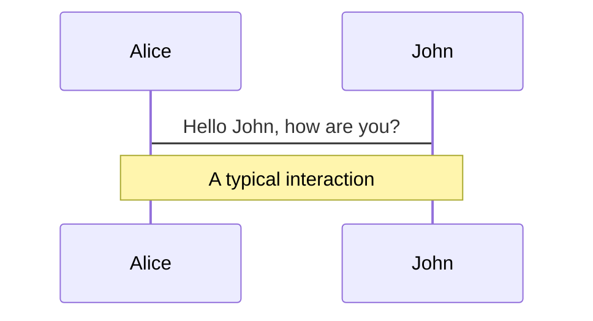
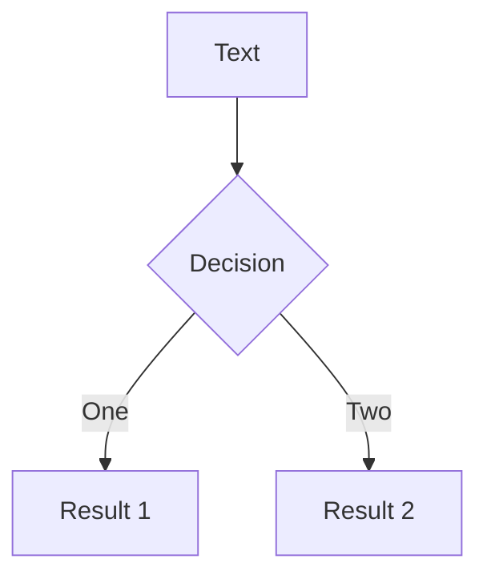

---
title: "L01: Product Framing & Setup"
---

<CourseCover
  color="green"
  tone="light"
  lesson="01"
  total="10"
  series="slidev-react Capability Tour"
  title="L01: Product Framing & Setup"
  subtitle="Start with the deck model, then shape the runtime around real authoring needs."
  author="hylarucoder"
/>

---
title: Welcome
layout: center
notes: |
  Use this slide to frame the repo in one sentence: slidev-react is a React-first presentation runtime, not a Vue Slidev clone.

  The main thing to emphasize here is that deck authoring stays simple because it is still MDX, but the runtime behavior is owned by this repo and shaped around React components, presenter mode, and presentation flow.

  When you transition, point out that the next few slides move from "what this project is" into "how the authoring model and runtime are actually structured."
---

# Welcome to slidev-react

Presentation slides for developers, authored in MDX and rendered with React.

<Badge>MDX</Badge>

<Callout title="Deck runtime">
This deck now reflects the `slidev-react` syntax the repo actually supports, rather than Vue Slidev primitives.
</Callout>

Press `Space` or `→` for next page.

---
title: What is slidev-react?
---

# What is slidev-react?

This repo is a React-first slide runtime with a compile-time MDX deck pipeline.

- Deck source file: `slides.mdx`
- Page split syntax: `---`
- Slide frontmatter: `title`, `layout`, `class`
- MDX components: `Badge`, `Callout`, `Annotate`, `Reveal`, `RevealGroup`
- Built-in diagram fences: Mermaid and PlantUML
- Presenter / viewer mode with sync-ready presentation flow

<Callout type="info" title="Architecture">
Deck parsing and MDX compilation live in `src/deck/`, while presentation behavior lives in `src/features/`.
</Callout>

---
title: Navigation
level: 2
---

# Navigation

## Keyboard Shortcuts

| Key | Action |
| --- | --- |
| `Right` / `Space` | next slide |
| `Left` / `Shift + Space` | previous slide |
| `Home` | first slide |
| `End` | last slide |

<Callout type="info" title="Runtime note">
The current MVP already supports `←/→/Space/Home/End`.
</Callout>

---
title: Deck Authoring Model
layout: default
---

# Deck Authoring Model

<div className="grid gap-6 md:grid-cols-2">
<div>

1. Deck-level frontmatter defines global metadata
2. `---` starts the next slide
3. Each slide may have its own frontmatter
4. The body is standard MDX + repo-provided components

</div>
<div>

```mdx
---
title: Compare
layout: two-cols
class: px-20
---

# Left column

<hr />

# Right column
```

</div>
</div>

<Callout type="info" title="Column split tip">
In `two-cols` and `image-right`, prefer `<hr />` to split the left and right regions. A raw `---` will be parsed as the next-slide separator.
</Callout>

---
title: Code
layout: default
---

# Code

Use code snippets with syntax highlight.

```tsx
import { useState } from 'react'

export function CounterCard() {
  const [count, setCount] = useState(0)

  return (
    <button onClick={() => setCount(count + 1)}>
      count: {count}
    </button>
  )
}
```

```ts
// External snippet example
export function emptyArray<T>(size: number): T[] {
  return Array.from({ length: size })
}
```

<Callout type="success" title="Compile-time highlight">
Code blocks are highlighted by Shiki at compile time, with `vitesse-light` as the current theme.
</Callout>

---
title: Shiki Magic Move
level: 2
---

# Shiki Magic Move

`slidev-react` integrates `shiki-magic-move/react` directly for code state transition demos.

The demo below uses the React implementation that ships in this repo:

<MagicMoveDemo />

---
title: P011 React Visualizer
layout: immersive
---

<MinimaxReactVisualizer />

---
title: Components
---

# Components

You can use React components directly in MDX.

<div className="grid gap-6 md:grid-cols-2">
<div>

```mdx
<Callout title="Tip">Use MDX components in slides.</Callout>
```

<Callout title="Tip">Use MDX components in slides.</Callout>

</div>
<div>

```mdx
<Badge>MVP</Badge>
```

<Badge>MVP</Badge>

</div>
</div>

---
title: Annotate
---

# Annotate

Use `Annotate` for presentation-style emphasis that feels more intentional than a plain highlight.

<div className="mt-6 grid gap-6 md:grid-cols-2">
<div>

```mdx
We use <Annotate>default highlight</Annotate> for the most important phrase.
The presenter can <Annotate type="underline">underline a key idea</Annotate>.
This slide can <Annotate type="box">box an API boundary</Annotate>.
```

<div className="space-y-4">
  <p>We use <Annotate>default highlight</Annotate> for the most important phrase.</p>
  <p>The presenter can <Annotate type="underline">underline a key idea</Annotate>.</p>
  <p>This slide can <Annotate type="box">box an API boundary</Annotate>.</p>
</div>

</div>
<div>

```mdx
We can <Annotate type="circle">circle launch</Annotate> for timing.
Use <Annotate type="strike-through">strike through an obsolete path</Annotate>.
```

<div className="space-y-4">
  <p>We can <Annotate type="circle">circle launch</Annotate> for timing.</p>
  <p>Use <Annotate type="strike-through">strike through an obsolete path</Annotate>.</p>
</div>

</div>
</div>

<div className="mt-8 space-y-4">
  <p>
    Keep the copy visible first, then{" "}
    <Annotate type="underline" step={1}>
      draw the mark on reveal
    </Annotate>
    .
  </p>
  <p>
    Or{" "}
    <Annotate type="box" step={2} animate={false}>
      show it instantly on the next reveal
    </Annotate>
    .
  </p>
</div>

---
title: Layouts & Classes
class: px-8
---

# Layouts & Classes

Use frontmatter to choose a layout and pass extra stage classes.

<div className="mt-4 grid gap-3 md:grid-cols-2">

```yaml
---
layout: cover
class: px-24
---
```

```yaml
---
layout: statement
---
```

<div className="rounded-xl border border-slate-200 bg-white/70 p-4">
  <strong className="block text-sm text-slate-900">Supported layouts</strong>
  <p className="mt-2 text-sm text-slate-700">
    `default`, `center`, `cover`, `section`, `immersive`, `two-cols`, `image-right`, `statement`
  </p>
</div>

<div className="rounded-xl border border-slate-200 bg-white/70 p-4">
  <strong className="block text-sm text-slate-900">Current theme status</strong>
  <p className="mt-2 text-sm text-slate-700">
    `theme:` is currently parsed as metadata only and is not wired to visual theme switching yet.
  </p>
</div>

</div>

<Callout type="info" title="Practical guidance">
For now, prefer `layout:` and `class:` because they already participate in rendering.
</Callout>

---
title: Reveal Flow
---

# Reveal Flow

In `slidev-react`, progressive reveals are built with `Reveal` and `RevealGroup`.

```mdx
<Reveal step={1}>
  <p>First click reveals this block.</p>
</Reveal>

<Reveal step={2} preset="scale-in">
  <p>Second click reveals this block.</p>
</Reveal>

<ul>
  <RevealGroup start={3} preset="fade-up" reserveSpace>
    <li>Third click reveals this point.</li>
    <li>Fourth click reveals this point.</li>
  </RevealGroup>
</ul>
```

This is the repo-native replacement for Slidev's `v-click`.

<Reveal step={1}>
  <p>This block appears on the first click.</p>
</Reveal>

<Reveal step={2} preset="scale-in">
  <p>This block appears on the second click.</p>
</Reveal>

<ul>
  <RevealGroup start={3} preset="fade-up" reserveSpace>
    <li>Third click reveals this point.</li>
    <li>Fourth click reveals this point.</li>
  </RevealGroup>
</ul>

---
title: Presentation Mode
---

# Presentation Mode

This repo already supports a live presentation workflow.

```text
Presenter: http://localhost:3000/presenter/1
Viewer:    http://localhost:3000/1
```

<div className="mt-6 grid gap-4 md:grid-cols-2">
  <Callout title="What works now">
    presenter / viewer roles, multi-tab sync, optional WebSocket relay, recording, drawings, cursor sync
  </Callout>
  <Callout type="success" title="Start relay">
    Run `pnpm presentation:server` when you want cross-device syncing.
  </Callout>
</div>

---
title: LaTeX
---

# $\LaTeX$

Inline: $\sqrt{3x-1}+(1+x)^2$

Block:

$$
\begin{aligned}
\nabla \cdot \vec{E} &= \frac{\rho}{\varepsilon_0} \\
\nabla \cdot \vec{B} &= 0 \\
\nabla \times \vec{E} &= -\frac{\partial\vec{B}}{\partial t} \\
\nabla \times \vec{B} &= \mu_0\vec{J} + \mu_0\varepsilon_0\frac{\partial\vec{E}}{\partial t}
\end{aligned}
$$
<Callout type="info" title="Math pipeline">
Math is currently rendered through `remark-math` + `rehype-katex`.
</Callout>

---
title: Diagrams
---

# Diagrams

You can describe diagrams directly in text.





```startuml
@startuml
package "Some Group" {
  HTTP - [First Component]
  [Another Component]
}
@enduml
```

---
title: Charts — Basic
---

# Charts — Basic

<div className="grid grid-cols-2 gap-4">
<div>

**BarChart**

<BarChart
  width={620}
  height={260}
  data={[
    { genre: "Sports", sold: 275 },
    { genre: "Strategy", sold: 115 },
    { genre: "Action", sold: 120 },
    { genre: "Shooter", sold: 350 },
    { genre: "RPG", sold: 180 },
    { genre: "Other", sold: 150 },
  ]}
  x="genre"
  y="sold"
  color="genre"
/>

</div>
<div>

**LineChart**

<LineChart
  width={620}
  height={260}
  data={[
    { month: "Jan", revenue: 4200 },
    { month: "Feb", revenue: 3800 },
    { month: "Mar", revenue: 5100 },
    { month: "Apr", revenue: 4700 },
    { month: "May", revenue: 6200 },
    { month: "Jun", revenue: 5800 },
    { month: "Jul", revenue: 7100 },
    { month: "Aug", revenue: 6900 },
    { month: "Sep", revenue: 8200 },
    { month: "Oct", revenue: 7800 },
    { month: "Nov", revenue: 9400 },
    { month: "Dec", revenue: 11200 },
  ]}
  x="month"
  y="revenue"
/>

</div>
<div>

**PieChart (donut)**

<PieChart
  width={620}
  height={260}
  data={[
    { brand: "Apple", share: 35 },
    { brand: "Samsung", share: 25 },
    { brand: "Xiaomi", share: 15 },
    { brand: "Huawei", share: 12 },
    { brand: "Other", share: 13 },
  ]}
  value="share"
  label="brand"
  donut
/>

</div>
<div>

**AreaChart (stacked)**

<AreaChart
  width={620}
  height={260}
  data={[
    { month: "Jan", users: 1200, channel: "Organic" },
    { month: "Feb", users: 1800, channel: "Organic" },
    { month: "Mar", users: 2400, channel: "Organic" },
    { month: "Apr", users: 3200, channel: "Organic" },
    { month: "May", users: 4100, channel: "Organic" },
    { month: "Jun", users: 5000, channel: "Organic" },
    { month: "Jan", users: 800, channel: "Paid" },
    { month: "Feb", users: 1200, channel: "Paid" },
    { month: "Mar", users: 1600, channel: "Paid" },
    { month: "Apr", users: 2000, channel: "Paid" },
    { month: "May", users: 2800, channel: "Paid" },
    { month: "Jun", users: 3500, channel: "Paid" },
  ]}
  x="month"
  y="users"
  color="channel"
  stack
/>

</div>
</div>

---
title: Charts — Advanced
---

# Charts — Advanced

<div className="grid grid-cols-2 gap-4">
<div>

**ScatterChart**

<ScatterChart
  width={620}
  height={260}
  data={[
    { height: 170, weight: 65, gender: "Male" },
    { height: 175, weight: 72, gender: "Male" },
    { height: 180, weight: 80, gender: "Male" },
    { height: 168, weight: 68, gender: "Male" },
    { height: 182, weight: 85, gender: "Male" },
    { height: 163, weight: 55, gender: "Female" },
    { height: 158, weight: 50, gender: "Female" },
    { height: 165, weight: 58, gender: "Female" },
    { height: 170, weight: 62, gender: "Female" },
    { height: 160, weight: 52, gender: "Female" },
    { height: 172, weight: 78, gender: "Male" },
    { height: 155, weight: 48, gender: "Female" },
  ]}
  x="height"
  y="weight"
  color="gender"
/>

</div>
<div>

**RadarChart (area)**

<RadarChart
  width={620}
  height={260}
  data={[
    { dim: "Frontend", score: 90, team: "Alpha" },
    { dim: "Backend", score: 75, team: "Alpha" },
    { dim: "Design", score: 60, team: "Alpha" },
    { dim: "DevOps", score: 85, team: "Alpha" },
    { dim: "Testing", score: 70, team: "Alpha" },
    { dim: "Frontend", score: 65, team: "Beta" },
    { dim: "Backend", score: 90, team: "Beta" },
    { dim: "Design", score: 80, team: "Beta" },
    { dim: "DevOps", score: 55, team: "Beta" },
    { dim: "Testing", score: 85, team: "Beta" },
  ]}
  x="dim"
  y="score"
  color="team"
  area
/>

</div>
<div>

**HeatmapChart**

<HeatmapChart
  width={620}
  height={260}
  data={[
    { week: "Mon", hour: "9am", value: 10 },
    { week: "Mon", hour: "12pm", value: 26 },
    { week: "Mon", hour: "3pm", value: 18 },
    { week: "Mon", hour: "6pm", value: 8 },
    { week: "Tue", hour: "9am", value: 14 },
    { week: "Tue", hour: "12pm", value: 32 },
    { week: "Tue", hour: "3pm", value: 22 },
    { week: "Tue", hour: "6pm", value: 12 },
    { week: "Wed", hour: "9am", value: 20 },
    { week: "Wed", hour: "12pm", value: 28 },
    { week: "Wed", hour: "3pm", value: 30 },
    { week: "Wed", hour: "6pm", value: 16 },
    { week: "Thu", hour: "9am", value: 18 },
    { week: "Thu", hour: "12pm", value: 35 },
    { week: "Thu", hour: "3pm", value: 24 },
    { week: "Thu", hour: "6pm", value: 10 },
    { week: "Fri", hour: "9am", value: 12 },
    { week: "Fri", hour: "12pm", value: 30 },
    { week: "Fri", hour: "3pm", value: 20 },
    { week: "Fri", hour: "6pm", value: 6 },
  ]}
  x="hour"
  y="week"
  color="value"
/>

</div>
<div>

**FunnelChart**

<Chart
  type="interval"
  width={620}
  height={260}
  data={[
    { stage: "Visitors", count: 5000 },
    { stage: "Sign-ups", count: 3200 },
    { stage: "Trials", count: 1800 },
    { stage: "Paid", count: 950 },
    { stage: "Retained", count: 600 },
  ]}
  encode={{ x: "stage", y: "count", color: "stage", shape: "funnel" }}
  coordinate={{ transform: [{ type: "transpose" }] }}
/>

</div>
</div>

---
title: Charts — Composite
---

# Charts — Composite

<div className="grid grid-cols-2 gap-4">
<div>

**GaugeChart**

<Chart
  preset="gauge"
  width={620}
  height={260}
  data={{ value: { target: 78, total: 100, name: 'Score' } }}
/>

</div>
<div>

**LiquidChart**

<Chart
  preset="liquid"
  width={620}
  height={260}
  data={0.72}
/>

</div>
<div>

**WordCloud**

<Chart
  type="wordCloud"
  width={620}
  height={260}
  data={[
    { text: "React", value: 120 },
    { text: "TypeScript", value: 100 },
    { text: "MDX", value: 85 },
    { text: "Slides", value: 75 },
    { text: "Presenter", value: 65 },
    { text: "Animation", value: 60 },
    { text: "Components", value: 55 },
    { text: "Themes", value: 50 },
    { text: "Charts", value: 48 },
    { text: "Layouts", value: 45 },
    { text: "Diagrams", value: 42 },
    { text: "Code", value: 40 },
    { text: "LaTeX", value: 38 },
    { text: "Export", value: 35 },
    { text: "Sync", value: 32 },
    { text: "Reveal", value: 30 },
    { text: "Mermaid", value: 28 },
    { text: "Keyboard", value: 25 },
    { text: "Navigation", value: 22 },
    { text: "Annotate", value: 20 },
  ]}
  encode={{ text: "text", value: "value", color: "text" }}
  legend={false}
/>

</div>
<div>

**Boxplot**

<Chart
  type="boxplot"
  width={620}
  height={260}
  data={[
    { category: "A", value: 10 }, { category: "A", value: 15 },
    { category: "A", value: 20 }, { category: "A", value: 25 },
    { category: "A", value: 30 }, { category: "A", value: 35 },
    { category: "A", value: 50 },
    { category: "B", value: 5 }, { category: "B", value: 12 },
    { category: "B", value: 18 }, { category: "B", value: 22 },
    { category: "B", value: 28 }, { category: "B", value: 40 },
    { category: "C", value: 8 }, { category: "C", value: 14 },
    { category: "C", value: 19 }, { category: "C", value: 24 },
    { category: "C", value: 32 }, { category: "C", value: 38 },
    { category: "C", value: 45 },
  ]}
  encode={{ x: "category", y: "value" }}
/>

</div>
</div>

---
title: Learn More
layout: center
class: text-center
---

# Learn More

`slides.mdx` is the deck source.

Open `/presenter/1` for presenter mode and `/1` for the viewer page.

<Callout type="success" title="Status">
The demo deck now reflects repo-supported `slidev-react` syntax instead of legacy Slidev/Vue examples.
</Callout>
