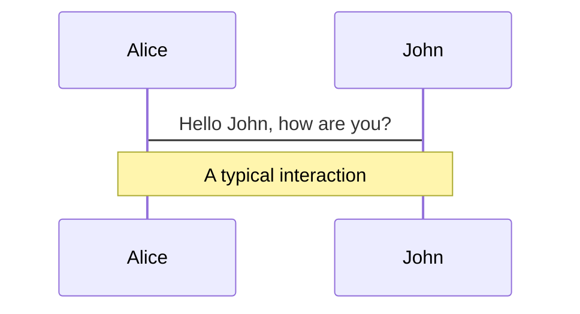
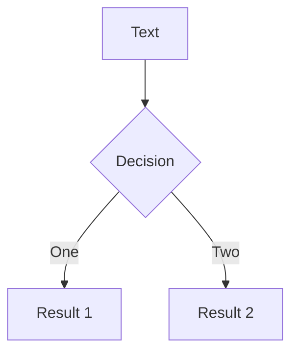

---
title: "L01: 产品定义 & 工具就位"
---

<CourseCover
  color="green"
  lesson="01"
  total="10"
  series="Claude Code + GPT-5.4 AI编程课"
  title="L01: 产品定义 & 工具就位"
  subtitle="不是先学代码，是先想清楚你要做什么"
  author="海拉鲁编程客"
/>

---
title: Welcome
layout: center
---

# Welcome to slidev-react

Presentation slides for developers, authored in MDX and rendered with React.

<Badge>MDX</Badge>

<Callout title="Deck runtime">
这份 deck 现在对齐的是仓库真实支持的 `slidev-react` 语法，而不是 Vue 版 Slidev 原语。
</Callout>

Press `Space` or `→` for next page.

---
title: What is slidev-react?
---

# What is slidev-react?

This repo is a React-first slide runtime with a compile-time MDX deck pipeline.

- Deck source file: `slides.mdx`
- Page split syntax: `---`
- Slide frontmatter: `title`, `layout`, `class`
- MDX components: `Badge`, `Callout`, `AnnotationMark`, `Reveal`, `RevealGroup`
- Built-in diagram fences: Mermaid and PlantUML
- Presenter / viewer mode with sync-ready presentation flow

<Callout type="info" title="Architecture">
Deck parsing and MDX compilation live in `src/deck/`, while presentation behavior lives in `src/features/`.
</Callout>

---
title: Navigation
level: 2
---

# Navigation

## Keyboard Shortcuts

| Key | Action |
| --- | --- |
| `Right` / `Space` | next slide |
| `Left` / `Shift + Space` | previous slide |
| `Home` | first slide |
| `End` | last slide |

<Callout type="info" title="Runtime note">
当前 MVP 里我们已实现 `←/→/Space/Home/End`。
</Callout>

---
title: Deck Authoring Model
layout: default
---

# Deck Authoring Model

<div className="grid gap-6 md:grid-cols-2">
<div>

1. Deck-level frontmatter defines global metadata
2. `---` starts the next slide
3. Each slide may have its own frontmatter
4. The body is standard MDX + repo-provided components

</div>
<div>

```mdx
---
title: Compare
layout: two-cols
class: px-20
---

# Left column

<hr />

# Right column
```

</div>
</div>

<Callout type="info" title="Column split tip">
在 `two-cols` 和 `image-right` 布局里，优先使用 `<hr />` 做左右分区。裸写 `---` 会被解析成下一页分隔符。
</Callout>

---
title: Code
layout: default
---

# Code

Use code snippets with syntax highlight.

```tsx
import { useState } from 'react'

export function CounterCard() {
  const [count, setCount] = useState(0)

  return (
    <button onClick={() => setCount(count + 1)}>
      count: {count}
    </button>
  )
}
```

```ts
// External snippet example
export function emptyArray<T>(size: number): T[] {
  return Array.from({ length: size })
}
```

<Callout type="success" title="Compile-time highlight">
代码块会在编译期走 Shiki，高亮主题当前是 `vitesse-light`。
</Callout>

---
title: Shiki Magic Move
level: 2
---

# Shiki Magic Move

`slidev-react` 直接集成了 `shiki-magic-move/react`，用来做代码块状态切换演示。

下面这个 demo 用的就是当前仓库的 React 版实现：

<MagicMoveDemo />

---
title: P011 React Visualizer
layout: immersive
---

<MinimaxReactVisualizer />

---
title: Components
---

# Components

You can use React components directly in MDX.

<div className="grid gap-6 md:grid-cols-2">
<div>

```mdx
<Callout title="Tip">Use MDX components in slides.</Callout>
```

<Callout title="Tip">Use MDX components in slides.</Callout>

</div>
<div>

```mdx
<Badge>MVP</Badge>
```

<Badge>MVP</Badge>

</div>
</div>

---
title: AnnotationMark
---

# AnnotationMark

Use `AnnotationMark` for presentation-style emphasis that feels more intentional than a plain highlight.

<div className="mt-6 grid gap-6 md:grid-cols-2">
<div>

```mdx
We use <AnnotationMark>default highlight</AnnotationMark> for the most important phrase.
The presenter can <AnnotationMark type="underline">underline a key idea</AnnotationMark>.
This slide can <AnnotationMark type="box">box an API boundary</AnnotationMark>.
```

<div className="space-y-4">
  <p>We use <AnnotationMark>default highlight</AnnotationMark> for the most important phrase.</p>
  <p>The presenter can <AnnotationMark type="underline">underline a key idea</AnnotationMark>.</p>
  <p>This slide can <AnnotationMark type="box">box an API boundary</AnnotationMark>.</p>
</div>

</div>
<div>

```mdx
We can <AnnotationMark type="circle">circle launch</AnnotationMark> for timing.
Use <AnnotationMark type="bracket" brackets={['left', 'right']}>brackets on a focus block</AnnotationMark>.
```

<div className="space-y-4">
  <p>We can <AnnotationMark type="circle">circle launch</AnnotationMark> for timing.</p>
  <p>Use <AnnotationMark type="bracket" brackets={['left', 'right']}>brackets on a focus block</AnnotationMark>.</p>
</div>

</div>
</div>

---
title: Layouts & Classes
class: px-8
---

# Layouts & Classes

Use frontmatter to choose a layout and pass extra stage classes.

<div className="mt-4 grid gap-3 md:grid-cols-2">

```yaml
---
layout: cover
class: px-24
---
```

```yaml
---
layout: statement
---
```

<div className="rounded-xl border border-slate-200 bg-white/70 p-4">
  <strong className="block text-sm text-slate-900">Supported layouts</strong>
  <p className="mt-2 text-sm text-slate-700">
    `default`, `center`, `cover`, `section`, `immersive`, `two-cols`, `image-right`, `statement`
  </p>
</div>

<div className="rounded-xl border border-slate-200 bg-white/70 p-4">
  <strong className="block text-sm text-slate-900">Current theme status</strong>
  <p className="mt-2 text-sm text-slate-700">
    `theme:` 目前只会被解析成 metadata，还没有真正接上视觉主题切换。
  </p>
</div>

</div>

<Callout type="info" title="Practical guidance">
现在优先使用 `layout:` 和 `class:`，它们已经实际参与渲染。
</Callout>

---
title: Reveal Flow
---

# Reveal Flow

`slidev-react` 里渐进揭示使用 `Reveal` 和 `RevealGroup`。

```mdx
<Reveal step={1}>
  <p>First click reveals this block.</p>
</Reveal>

<Reveal step={2} preset="scale-in">
  <p>Second click reveals this block.</p>
</Reveal>

<ul>
  <RevealGroup start={3} preset="fade-up" reserveSpace>
    <li>Third click reveals this point.</li>
    <li>Fourth click reveals this point.</li>
  </RevealGroup>
</ul>
```

This is the repo-native replacement for Slidev's `v-click`.

<Reveal step={1}>
  <p>This block appears on the first click.</p>
</Reveal>

<Reveal step={2} preset="scale-in">
  <p>This block appears on the second click.</p>
</Reveal>

<ul>
  <RevealGroup start={3} preset="fade-up" reserveSpace>
    <li>Third click reveals this point.</li>
    <li>Fourth click reveals this point.</li>
  </RevealGroup>
</ul>

---
title: Presentation Mode
---

# Presentation Mode

This repo already supports a live presentation workflow.

```text
Presenter: http://localhost:3000/presenter/1
Viewer:    http://localhost:3000/1
```

<div className="mt-6 grid gap-4 md:grid-cols-2">
  <Callout title="What works now">
    presenter / viewer roles, multi-tab sync, optional WebSocket relay, recording, drawings, cursor sync
  </Callout>
  <Callout type="success" title="Start relay">
    Run `bun run presentation:server` when you want cross-device syncing.
  </Callout>
</div>

---
title: LaTeX
---

# $\LaTeX$

Inline: $\sqrt{3x-1}+(1+x)^2$

Block:

$$
\begin{aligned}
\nabla \cdot \vec{E} &= \frac{\rho}{\varepsilon_0} \\
\nabla \cdot \vec{B} &= 0 \\
\nabla \times \vec{E} &= -\frac{\partial\vec{B}}{\partial t} \\
\nabla \times \vec{B} &= \mu_0\vec{J} + \mu_0\varepsilon_0\frac{\partial\vec{E}}{\partial t}
\end{aligned}
$$
<Callout type="info" title="Math pipeline">
当前数学公式通过 `remark-math` + `rehype-katex` 渲染。
</Callout>

---
title: Diagrams
---

# Diagrams

You can describe diagrams directly in text.





```startuml
@startuml
package "Some Group" {
  HTTP - [First Component]
  [Another Component]
}
@enduml
```

---
title: Learn More
layout: center
class: text-center
---

# Learn More

`slides.mdx` is the deck source.

Open `/presenter/1` for presenter mode and `/1` for the viewer page.

<Callout type="success" title="Status">
The demo deck now reflects repo-supported `slidev-react` syntax instead of legacy Slidev/Vue examples.
</Callout>
