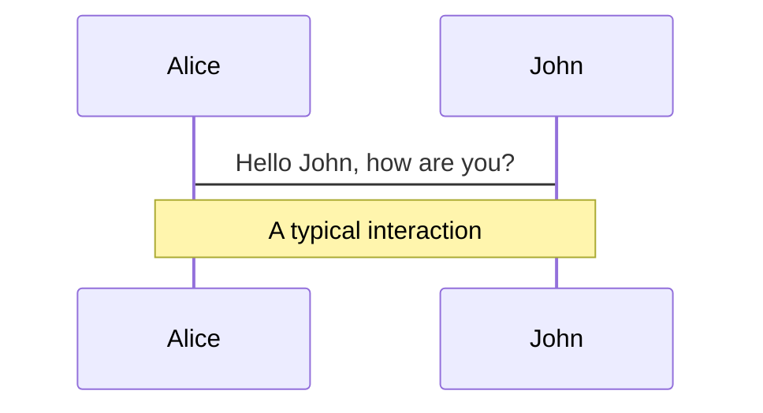
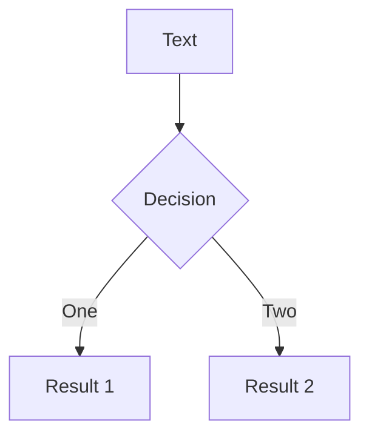

---
title: "slidev-react Capability Tour"
notes: |
  This is the cover slide. It uses the CourseCover component to illustrate how custom React components can serve as full-page slide content.
---

<CourseCover
  color="green"
  tone="light"
  lesson="01"
  total="01"
  series="slidev-react Capability Tour"
  title="slidev-react Capability Tour"
  subtitle="A complete walkthrough of every feature the runtime supports today."
  author="hylarucoder"
/>

---
title: "§ Authoring"
layout: section
notes: |
  Section divider for the Authoring block. The `section` layout centers a heading as a visual separator between topics.
---

# Authoring

---
title: Welcome
layout: center
notes: |
  Frame the repo in one sentence: slidev-react is a React-first presentation runtime, not a Vue Slidev clone.

  The main thing to emphasize is that deck authoring stays simple because it is still MDX, but the runtime behavior is owned by this repo and shaped around React components, presenter mode, and presentation flow.
---

# Welcome to slidev-react

Presentation slides for developers, authored in MDX and rendered with React.

<Badge>MDX</Badge>

<Callout title="What this is">
A React-first slide runtime with a compile-time MDX deck pipeline. Deck source lives in `slides.mdx`, pages are split by `---`, and each slide may carry its own frontmatter (`title`, `layout`, `class`).
</Callout>

Press `Space` or `→` for next page.

---
title: Deck Authoring Model
layout: default
notes: |
  This slide explains the four rules of the authoring model. Notice that the slide itself uses a two-column grid to show MDX source on the right and the explanation on the left — a dogfooding pattern used throughout this deck.
---

# Deck Authoring Model

<div className="grid gap-6 md:grid-cols-2">
<div>

1. Deck-level frontmatter defines global metadata
2. `---` starts the next slide
3. Each slide may have its own frontmatter
4. The body is standard MDX + repo-provided components

</div>
<div>

```mdx
---
title: Compare
layout: two-cols
class: px-20
---

# Left column

<hr />

# Right column
```

</div>
</div>

<Callout type="info" title="Column split tip">
In `two-cols` and `image-right`, prefer `<hr />` to split the left and right regions. A raw `---` will be parsed as the next-slide separator.
</Callout>

---
title: Navigation
level: 2
notes: |
  All these shortcuts are already implemented. Press `?` or double-tap `Shift` to bring up the full keyboard shortcuts help overlay at any time during the presentation.
---

# Navigation

## Keyboard Shortcuts

| Key | Action |
| --- | --- |
| `Right` / `Space` | next slide |
| `Left` / `Shift + Space` | previous slide |
| `Home` | first slide |
| `End` | last slide |
| `?` / `Shift Shift` | keyboard shortcuts help |
| `O` | quick overview |
| `N` | notes workspace (presenter only) |

<Callout type="info" title="Runtime note">
Press `?` or double-tap `Shift` to see the full shortcuts help overlay with every implemented binding.
</Callout>

---
title: "§ Content"
layout: section
notes: |
  Section divider for the Content block — code, math, and diagrams.
---

# Content

---
title: Code
layout: default
notes: |
  Code blocks are highlighted by Shiki at compile time, using the `vitesse-light` theme. The MDX pipeline in `packages/node/src/slides/` handles the transformation.
---

# Code

Use code snippets with syntax highlight.

```tsx
import { useState } from 'react'

export function CounterCard() {
  const [count, setCount] = useState(0)

  return (
    <button onClick={() => setCount(count + 1)}>
      count: {count}
    </button>
  )
}
```

```ts
// External snippet example
export function emptyArray<T>(size: number): T[] {
  return Array.from({ length: size })
}
```

<Callout type="success" title="Compile-time highlight">
Code blocks are highlighted by Shiki at compile time, with `vitesse-light` as the current theme.
</Callout>

---
title: Shiki Magic Move
level: 2
notes: |
  Magic Move is powered by `shiki-magic-move/react` and renders animated transitions between code states. The demo component lives in `packages/client/src/ui/mdx/MagicMoveDemo.tsx`.
---

# Shiki Magic Move

`slidev-react` integrates `shiki-magic-move/react` directly for code state transition demos.

The demo below uses the React implementation that ships in this repo:

<CodeMagicMove steps={[
  `const message = 'Hello'\nconst target = 'world'\n\nconsole.log(message, target)`,
  `const message = 'Hi'\nconst target = user.name\n\nconsole.log(\`${"${message}"}, ${"${target}"}!\`)`,
  `function greet(target: string) {\n  const message = 'Hi'\n\n  return \`${"${message}"}, ${"${target}"}!\`\n}`,
]} />

---
title: LaTeX
notes: |
  Math is rendered through `remark-math` + `rehype-katex` during MDX compilation. Both inline and block-level math are supported.
---

# $\LaTeX$

Inline: $\sqrt{3x-1}+(1+x)^2$

Block:

$$
\begin{aligned}
\nabla \cdot \vec{E} &= \frac{\rho}{\varepsilon_0} \\
\nabla \cdot \vec{B} &= 0 \\
\nabla \times \vec{E} &= -\frac{\partial\vec{B}}{\partial t} \\
\nabla \times \vec{B} &= \mu_0\vec{J} + \mu_0\varepsilon_0\frac{\partial\vec{E}}{\partial t}
\end{aligned}
$$
<Callout type="info" title="Math pipeline">
Math is currently rendered through `remark-math` + `rehype-katex`.
</Callout>

---
title: Diagrams
notes: |
  Diagram fences are transformed during compilation. Mermaid and G2 are loaded as addons declared in deck frontmatter, while PlantUML ships as a core component. The addon registry lives in `packages/client/src/addons/registry.ts`.
---

# Diagrams

You can describe diagrams directly in text.





```startuml
@startuml
package "Some Group" {
  HTTP - [First Component]
  [Another Component]
}
@enduml
```

---
title: "§ Components"
layout: section
notes: |
  Section divider for the Components block — built-in MDX components available to every slide.
---

# Components

---
title: Built-in Components
notes: |
  Badge and Callout are primitives that live in `packages/client/src/ui/primitives/`. They are registered as MDX components and available in every slide without imports.
---

# Built-in Components

You can use React components directly in MDX.

<div className="grid gap-6 md:grid-cols-2">
<div>

```mdx
<Callout title="Tip">Use MDX components in slides.</Callout>
```

<Callout title="Tip">Use MDX components in slides.</Callout>

</div>
<div>

```mdx
<Badge>MVP</Badge>
```

<Badge>MVP</Badge>

</div>
</div>

---
title: Annotate
notes: |
  Annotate is a Rough Notation-style component with five built-in types. When used with `step`, annotations coordinate with the Reveal system — they draw on reveal. The `animate` prop can disable the drawing animation for instant marks.
---

# Annotate

Use `Annotate` for presentation-style emphasis that feels more intentional than a plain highlight.

<div className="mt-6 grid gap-6 md:grid-cols-2">
<div>

```mdx
We use <Annotate>default highlight</Annotate> for the most important phrase.
The presenter can <Annotate type="underline">underline a key idea</Annotate>.
This slide can <Annotate type="box">box an API boundary</Annotate>.
```

<div className="space-y-4">
  <p>We use <Annotate>default highlight</Annotate> for the most important phrase.</p>
  <p>The presenter can <Annotate type="underline">underline a key idea</Annotate>.</p>
  <p>This slide can <Annotate type="box">box an API boundary</Annotate>.</p>
</div>

</div>
<div>

```mdx
We can <Annotate type="circle">circle launch</Annotate> for timing.
Use <Annotate type="strike-through">strike through an obsolete path</Annotate>.
```

<div className="space-y-4">
  <p>We can <Annotate type="circle">circle launch</Annotate> for timing.</p>
  <p>Use <Annotate type="strike-through">strike through an obsolete path</Annotate>.</p>
</div>

</div>
</div>

<div className="mt-8 space-y-4">
  <p>
    Keep the copy visible first, then{" "}
    <Annotate type="underline" step={1}>
      draw the mark on reveal
    </Annotate>
    .
  </p>
  <p>
    Or{" "}
    <Annotate type="box" step={2} animate={false}>
      show it instantly on the next reveal
    </Annotate>
    .
  </p>
</div>

---
title: Insight
notes: |
  The Insight component comes from the `insight` addon, declared in deck frontmatter. It provides a styled aside block for key takeaways. The addon also registers a `spotlight` layout for full-page emphasis slides.
---

# Insight

The `insight` addon provides a styled aside component for key takeaways and a `spotlight` layout.

<div className="grid gap-6 md:grid-cols-2">
<div>

```mdx
<Insight title="Key Takeaway">
  Addons can contribute both components and layouts.
</Insight>
```

</div>
<div>

<Insight title="Key Takeaway">
  Addons can contribute both components and layouts. Declare the addon in your deck frontmatter and its components become available in every slide.
</Insight>

</div>
</div>

<Callout type="info" title="Addon declaration">
Add `insight` to the `addons` list in your deck frontmatter to enable this component.
</Callout>

---
title: Step Flow
notes: |
  Step and Steps are the repo-native replacement for Slidev's `v-click`. They coordinate with the presentation flow engine in `packages/client/src/features/presentation/reveal/`. The `preset` prop supports `fade`, `fade-up`, and `scale-in` animations.
---

# Step Flow

In `slidev-react`, progressive reveals are built with `Step` and `Steps`.

```mdx
<Step step={1}>
  <p>First click reveals this block.</p>
</Step>

<Step step={2} preset="scale-in">
  <p>Second click reveals this block.</p>
</Step>

<ul>
  <Steps start={3} preset="fade-up" reserveSpace>
    <li>Third click reveals this point.</li>
    <li>Fourth click reveals this point.</li>
  </Steps>
</ul>
```

This is the repo-native replacement for Slidev's `v-click`.

<Step step={1}>
  <p>This block appears on the first click.</p>
</Step>

<Step step={2} preset="scale-in">
  <p>This block appears on the second click.</p>
</Step>

<ul>
  <Steps start={3} preset="fade-up" reserveSpace>
    <li>Third click reveals this point.</li>
    <li>Fourth click reveals this point.</li>
  </Steps>
</ul>

---
title: "§ Layouts & Theming"
layout: section
notes: |
  Section divider for the Layouts & Theming block — how slides are visually structured and styled.
---

# Layouts & Theming

---
title: Layouts & Classes
class: px-8
notes: |
  Layouts are React components registered in `packages/client/src/theme/layouts/`. The `class` frontmatter prop passes extra CSS classes directly to the slide stage element.
---

# Layouts & Classes

Use frontmatter to choose a layout and pass extra stage classes.

<div className="mt-4 grid gap-3 md:grid-cols-2">

```yaml
---
layout: cover
class: px-24
---
```

```yaml
---
layout: statement
---
```

<div className="rounded-xl border border-slate-200 bg-white/70 p-4">
  <strong className="block text-sm text-slate-900">Supported layouts</strong>
  <p className="mt-2 text-sm text-slate-700">
    `default`, `center`, `cover`, `section`, `immersive`, `two-cols`, `image-right`, `statement`
  </p>
</div>

<div className="rounded-xl border border-slate-200 bg-white/70 p-4">
  <strong className="block text-sm text-slate-900">Addon layouts</strong>
  <p className="mt-2 text-sm text-slate-700">
    Addons can register additional layouts. The `insight` addon adds a `spotlight` layout for full-page emphasis.
  </p>
</div>

</div>

<Callout type="info" title="Practical guidance">
For now, prefer `layout:` and `class:` because they already participate in rendering.
</Callout>

---
title: Slide Transitions
notes: |
  Slide transitions are CSS-based animations defined in `packages/client/src/theme/transitions.css`. Four transition types are built in: `fade`, `slide-left`, `slide-up`, and `zoom`. All transitions respect `prefers-reduced-motion`.
---

# Slide Transitions

Slide transitions are CSS-based animations that play when navigating between slides.

| Transition | Effect |
| --- | --- |
| `fade` | Cross-fade opacity |
| `slide-left` | Slide in from the right with fade |
| `slide-up` | Slide up from below with fade |
| `zoom` | Scale up from 96% with fade |

```yaml
---
title: My Slide
transition: slide-left
---
```

<Callout type="info" title="Reduced motion">
All transitions respect `prefers-reduced-motion: reduce` — animations are disabled automatically for users who prefer it.
</Callout>

---
title: Theme & Addon System
notes: |
  The addon system lives in `packages/client/src/addons/registry.ts`. Each addon is a self-contained module that can contribute layouts, MDX components, a React context provider, and CSS. The deck frontmatter `addons` array determines which addons are active. The theme registry at `packages/client/src/theme/registry.ts` handles layout resolution.
---

# Theme & Addon System

slidev-react uses a modular system where **addons** extend the runtime with new layouts, components, and providers.

<div className="grid gap-6 md:grid-cols-2">
<div>

**Addon declaration** — in deck frontmatter:

```yaml
---
addons:
  - mermaid
  - g2
  - insight
---
```

</div>
<div>

**Addon structure** — each addon exports:

```ts
export const addon: SlideAddonDefinition = {
  id: "insight",
  label: "Insight",
  provider: InsightAddonProvider,
  layouts: { spotlight: SpotlightLayout },
  mdxComponents: { Insight },
}
```

</div>
</div>

<Callout type="info" title="Architecture">
Addons are glob-imported from `packages/client/src/addons/*/index.ts`. The registry merges their layouts and MDX components into the runtime automatically.
</Callout>

---
title: "§ Charts"
layout: section
notes: |
  Section divider for the Charts block. Charts are powered by the G2 addon.
---

# Charts

---
title: Charts — Basic
notes: |
  The G2 addon provides convenience chart components (BarChart, LineChart, PieChart, AreaChart) that wrap the low-level Chart component with sensible defaults. These live in `packages/client/src/addons/g2/G2Chart.tsx`.
---

# Charts — Basic

<div className="grid grid-cols-2 gap-4">
<div>

**BarChart**

<BarChart
  width={620}
  height={260}
  data={[
    { genre: "Sports", sold: 275 },
    { genre: "Strategy", sold: 115 },
    { genre: "Action", sold: 120 },
    { genre: "Shooter", sold: 350 },
    { genre: "RPG", sold: 180 },
    { genre: "Other", sold: 150 },
  ]}
  x="genre"
  y="sold"
  color="genre"
/>

</div>
<div>

**LineChart**

<LineChart
  width={620}
  height={260}
  data={[
    { month: "Jan", revenue: 4200 },
    { month: "Feb", revenue: 3800 },
    { month: "Mar", revenue: 5100 },
    { month: "Apr", revenue: 4700 },
    { month: "May", revenue: 6200 },
    { month: "Jun", revenue: 5800 },
    { month: "Jul", revenue: 7100 },
    { month: "Aug", revenue: 6900 },
    { month: "Sep", revenue: 8200 },
    { month: "Oct", revenue: 7800 },
    { month: "Nov", revenue: 9400 },
    { month: "Dec", revenue: 11200 },
  ]}
  x="month"
  y="revenue"
/>

</div>
<div>

**PieChart (donut)**

<PieChart
  width={620}
  height={260}
  data={[
    { brand: "Apple", share: 35 },
    { brand: "Samsung", share: 25 },
    { brand: "Xiaomi", share: 15 },
    { brand: "Huawei", share: 12 },
    { brand: "Other", share: 13 },
  ]}
  value="share"
  label="brand"
  donut
/>

</div>
<div>

**AreaChart (stacked)**

<AreaChart
  width={620}
  height={260}
  data={[
    { month: "Jan", users: 1200, channel: "Organic" },
    { month: "Feb", users: 1800, channel: "Organic" },
    { month: "Mar", users: 2400, channel: "Organic" },
    { month: "Apr", users: 3200, channel: "Organic" },
    { month: "May", users: 4100, channel: "Organic" },
    { month: "Jun", users: 5000, channel: "Organic" },
    { month: "Jan", users: 800, channel: "Paid" },
    { month: "Feb", users: 1200, channel: "Paid" },
    { month: "Mar", users: 1600, channel: "Paid" },
    { month: "Apr", users: 2000, channel: "Paid" },
    { month: "May", users: 2800, channel: "Paid" },
    { month: "Jun", users: 3500, channel: "Paid" },
  ]}
  x="month"
  y="users"
  color="channel"
  stack
/>

</div>
</div>

---
title: Charts — Advanced
notes: |
  Advanced chart types like ScatterChart, RadarChart, and HeatmapChart use the same G2 addon. The FunnelChart demonstrates the low-level `<Chart>` component with explicit encode and coordinate transforms.
---

# Charts — Advanced

<div className="grid grid-cols-2 gap-4">
<div>

**ScatterChart**

<ScatterChart
  width={620}
  height={260}
  data={[
    { height: 170, weight: 65, gender: "Male" },
    { height: 175, weight: 72, gender: "Male" },
    { height: 180, weight: 80, gender: "Male" },
    { height: 168, weight: 68, gender: "Male" },
    { height: 182, weight: 85, gender: "Male" },
    { height: 163, weight: 55, gender: "Female" },
    { height: 158, weight: 50, gender: "Female" },
    { height: 165, weight: 58, gender: "Female" },
    { height: 170, weight: 62, gender: "Female" },
    { height: 160, weight: 52, gender: "Female" },
    { height: 172, weight: 78, gender: "Male" },
    { height: 155, weight: 48, gender: "Female" },
  ]}
  x="height"
  y="weight"
  color="gender"
/>

</div>
<div>

**RadarChart (area)**

<RadarChart
  width={620}
  height={260}
  data={[
    { dim: "Frontend", score: 90, team: "Alpha" },
    { dim: "Backend", score: 75, team: "Alpha" },
    { dim: "Design", score: 60, team: "Alpha" },
    { dim: "DevOps", score: 85, team: "Alpha" },
    { dim: "Testing", score: 70, team: "Alpha" },
    { dim: "Frontend", score: 65, team: "Beta" },
    { dim: "Backend", score: 90, team: "Beta" },
    { dim: "Design", score: 80, team: "Beta" },
    { dim: "DevOps", score: 55, team: "Beta" },
    { dim: "Testing", score: 85, team: "Beta" },
  ]}
  x="dim"
  y="score"
  color="team"
  area
/>

</div>
<div>

**HeatmapChart**

<HeatmapChart
  width={620}
  height={260}
  data={[
    { week: "Mon", hour: "9am", value: 10 },
    { week: "Mon", hour: "12pm", value: 26 },
    { week: "Mon", hour: "3pm", value: 18 },
    { week: "Mon", hour: "6pm", value: 8 },
    { week: "Tue", hour: "9am", value: 14 },
    { week: "Tue", hour: "12pm", value: 32 },
    { week: "Tue", hour: "3pm", value: 22 },
    { week: "Tue", hour: "6pm", value: 12 },
    { week: "Wed", hour: "9am", value: 20 },
    { week: "Wed", hour: "12pm", value: 28 },
    { week: "Wed", hour: "3pm", value: 30 },
    { week: "Wed", hour: "6pm", value: 16 },
    { week: "Thu", hour: "9am", value: 18 },
    { week: "Thu", hour: "12pm", value: 35 },
    { week: "Thu", hour: "3pm", value: 24 },
    { week: "Thu", hour: "6pm", value: 10 },
    { week: "Fri", hour: "9am", value: 12 },
    { week: "Fri", hour: "12pm", value: 30 },
    { week: "Fri", hour: "3pm", value: 20 },
    { week: "Fri", hour: "6pm", value: 6 },
  ]}
  x="hour"
  y="week"
  color="value"
/>

</div>
<div>

**FunnelChart**

<Chart
  type="interval"
  width={620}
  height={260}
  data={[
    { stage: "Visitors", count: 5000 },
    { stage: "Sign-ups", count: 3200 },
    { stage: "Trials", count: 1800 },
    { stage: "Paid", count: 950 },
    { stage: "Retained", count: 600 },
  ]}
  encode={{ x: "stage", y: "count", color: "stage", shape: "funnel" }}
  coordinate={{ transform: [{ type: "transpose" }] }}
/>

</div>
</div>

---
title: Charts — Composite
notes: |
  Composite chart types like Gauge, Liquid, WordCloud, and Boxplot use the `preset` prop or the low-level `type` prop on the `<Chart>` component. These are more specialized G2 visualizations.
---

# Charts — Composite

<div className="grid grid-cols-2 gap-4">
<div>

**GaugeChart**

<Chart
  preset="gauge"
  width={620}
  height={260}
  data={{ value: { target: 78, total: 100, name: 'Score' } }}
/>

</div>
<div>

**LiquidChart**

<Chart
  preset="liquid"
  width={620}
  height={260}
  data={0.72}
/>

</div>
<div>

**WordCloud**

<Chart
  type="wordCloud"
  width={620}
  height={260}
  data={[
    { text: "React", value: 120 },
    { text: "TypeScript", value: 100 },
    { text: "MDX", value: 85 },
    { text: "Slides", value: 75 },
    { text: "Presenter", value: 65 },
    { text: "Animation", value: 60 },
    { text: "Components", value: 55 },
    { text: "Themes", value: 50 },
    { text: "Charts", value: 48 },
    { text: "Layouts", value: 45 },
    { text: "Diagrams", value: 42 },
    { text: "Code", value: 40 },
    { text: "LaTeX", value: 38 },
    { text: "Export", value: 35 },
    { text: "Sync", value: 32 },
    { text: "Reveal", value: 30 },
    { text: "Mermaid", value: 28 },
    { text: "Keyboard", value: 25 },
    { text: "Navigation", value: 22 },
    { text: "Annotate", value: 20 },
  ]}
  encode={{ text: "text", value: "value", color: "text" }}
  legend={false}
/>

</div>
<div>

**Boxplot**

<Chart
  type="boxplot"
  width={620}
  height={260}
  data={[
    { category: "A", value: 10 }, { category: "A", value: 15 },
    { category: "A", value: 20 }, { category: "A", value: 25 },
    { category: "A", value: 30 }, { category: "A", value: 35 },
    { category: "A", value: 50 },
    { category: "B", value: 5 }, { category: "B", value: 12 },
    { category: "B", value: 18 }, { category: "B", value: 22 },
    { category: "B", value: 28 }, { category: "B", value: 40 },
    { category: "C", value: 8 }, { category: "C", value: 14 },
    { category: "C", value: 19 }, { category: "C", value: 24 },
    { category: "C", value: 32 }, { category: "C", value: 38 },
    { category: "C", value: 45 },
  ]}
  encode={{ x: "category", y: "value" }}
/>

</div>
</div>

---
title: "§ Presentation Runtime"
layout: section
notes: |
  Section divider for the Presentation Runtime block — live presentation features like presenter mode, drawing, overview panels, and recording.
---

# Presentation Runtime

---
title: Presenter & Viewer Mode
notes: |
  The presentation session engine lives in `packages/client/src/features/presentation/session.ts`. It supports multi-tab sync via BroadcastChannel and optional WebSocket relay for cross-device syncing. Cursor position is also synced between presenter and viewer.
---

# Presenter & Viewer Mode

This repo supports a live presentation workflow with two roles.

```text
Presenter: http://localhost:3000/presenter/1
Viewer:    http://localhost:3000/1
```

<div className="mt-6 grid gap-4 md:grid-cols-2">
  <Callout title="What works now">
    presenter / viewer roles, multi-tab sync via BroadcastChannel, optional WebSocket relay, recording, drawings, cursor sync
  </Callout>
  <Callout type="success" title="Start relay">
    Run `pnpm presentation:server` when you want cross-device syncing.
  </Callout>
</div>

---
title: Drawing & Annotation
notes: |
  The drawing system is built with SVG overlays and supports per-slide stroke persistence via localStorage. Drawing tools live in `packages/client/src/features/presentation/draw/`. All shortcuts only work in presenter mode.
---

# Drawing & Annotation

Draw live annotations on top of any slide during your presentation.

| Key | Action |
| --- | --- |
| `D` | Toggle draw mode |
| `P` | Switch to pen |
| `B` | Switch to circle |
| `R` | Switch to rectangle |
| `E` | Switch to eraser |
| `C` | Clear strokes on current slide |
| `Cmd/Ctrl + Z` | Undo the last stroke |

<Callout type="info" title="Persistence">
Strokes are saved per-slide in localStorage — they survive page reloads. Drawing tools are only available in presenter mode.
</Callout>

---
title: Overview Panels
notes: |
  Quick Overview (`O`) shows a grid of live slide thumbnails rendered with `SlidePreviewSurface`. Notes Overview (`N`) shows all speaker notes in one scrollable panel. Both live in `packages/client/src/features/presentation/overview/`.
---

# Overview Panels

Two overlay panels help you navigate and review your deck during a presentation.

<div className="grid gap-6 md:grid-cols-2">
<div>

### Quick Overview

Press `O` to toggle a grid of **live slide thumbnails**. Click any slide to jump to it.

- Each thumbnail shows the slide number and layout tag
- The current slide is highlighted with an emerald ring
- Close with `O` or `Esc`

</div>
<div>

### Notes Overview

Press `N` (presenter only) to toggle a **scrollable notes workspace** showing all speaker notes alongside slide previews.

- Every slide with `notes:` frontmatter appears in the panel
- Useful for rehearsal and quick scanning

</div>
</div>

---
title: Keyboard Shortcuts Help
notes: |
  The shortcuts help overlay is built in `packages/client/src/features/presentation/navigation/ShortcutsHelpOverlay.tsx`. It dynamically builds the shortcuts list based on what is available in the current context (e.g. draw shortcuts only show in presenter mode).
---

# Keyboard Shortcuts Help

Press `?` or **double-tap `Shift`** to open the full keyboard shortcuts help panel.

<div className="grid gap-6 md:grid-cols-3">
  <div className="rounded-xl border border-slate-200 bg-white/70 p-4">
    <strong className="block text-sm text-slate-900">Navigation</strong>
    <p className="mt-2 text-sm text-slate-700">Arrow keys, Space, Home, End</p>
  </div>
  <div className="rounded-xl border border-slate-200 bg-white/70 p-4">
    <strong className="block text-sm text-slate-900">Overlays</strong>
    <p className="mt-2 text-sm text-slate-700">`?` help, `O` overview, `N` notes, `Esc` close</p>
  </div>
  <div className="rounded-xl border border-slate-200 bg-white/70 p-4">
    <strong className="block text-sm text-slate-900">Draw</strong>
    <p className="mt-2 text-sm text-slate-700">`D` toggle, `P/B/R/E` tools, `C` clear, `⌘Z` undo</p>
  </div>
</div>

<Callout type="info" title="Context-aware">
The help panel dynamically adjusts its content — draw shortcuts only appear in presenter mode.
</Callout>

---
title: Recording
notes: |
  Recording uses `navigator.mediaDevices.getDisplayMedia` + `MediaRecorder`. The hook lives in `packages/client/src/features/presentation/usePresentationRecorder.ts`. It prefers VP9/Opus codec and falls back to VP8 or plain WebM. The recording downloads automatically when stopped.
---

# Recording

Record your presentation as a WebM video directly from the browser.

<div className="grid gap-6 md:grid-cols-2">
<div>

**How it works:**

1. Click the **record** button in the presenter toolbar
2. Browser prompts you to share your screen
3. Present your slides as usual
4. Stop recording — the WebM file downloads automatically

</div>
<div>

**Technical details:**

- Uses `getDisplayMedia` + `MediaRecorder` APIs
- Prefers VP9/Opus codec, falls back to VP8 or plain WebM
- Elapsed time is shown in the UI during recording
- A descriptive filename is generated from the deck title

</div>
</div>

<Callout type="info" title="Browser support">
Recording requires a browser that supports MediaRecorder and `getDisplayMedia`. Most modern desktop browsers qualify.
</Callout>

---
title: "§ Tooling"
layout: section
notes: |
  Section divider for the Tooling block — CLI commands for export and lint.
---

# Tooling

---
title: Export
notes: |
  The export pipeline spins up a dev server, navigates Playwright to the print layout, and captures each slide as PDF or PNG. The code lives in `packages/node/src/export.ts` and `exportBrowser.ts`. You need to install Playwright's Chromium first with `pnpm test:e2e:install`.
---

# Export (PDF / PNG)

Export your deck as static PDF pages or individual PNG images.

```bash
# Export as PDF (default)
pnpm slidev-react export

# Export as PNG images
pnpm slidev-react export --format png

# Include click-reveal variants as separate pages
pnpm slidev-react export --with-clicks

# Export specific slides only
pnpm slidev-react export --slides 1,3,5-8
```

<Callout type="info" title="Prerequisite">
Run `pnpm test:e2e:install` first to install the Chromium browser that Playwright uses for rendering.
</Callout>

---
title: Lint & CLI
notes: |
  The lint command parses `slides.mdx` and runs validation checks defined in `packages/node/src/slides/validation/validateSlidesAuthoring.ts`. In `--strict` mode, any warning causes a non-zero exit code. The CLI entry point lives in `packages/cli/`.
---

# Lint & CLI

Validate your deck authoring before presenting.

```bash
# Run slides linter
pnpm slidev-react lint

# Strict mode — any warning becomes an error
pnpm slidev-react lint --strict

# Lint a specific file
pnpm slidev-react lint --slides custom-deck.mdx
```

<div className="grid gap-6 md:grid-cols-2">
  <div className="rounded-xl border border-slate-200 bg-white/70 p-4">
    <strong className="block text-sm text-slate-900">What it checks</strong>
    <p className="mt-2 text-sm text-slate-700">
      Frontmatter validity, layout references, component usage, and slide structure.
    </p>
  </div>
  <div className="rounded-xl border border-slate-200 bg-white/70 p-4">
    <strong className="block text-sm text-slate-900">CLI commands</strong>
    <p className="mt-2 text-sm text-slate-700">
      `dev` — start dev server · `build` — production build · `export` — PDF/PNG · `lint` — validate deck
    </p>
  </div>
</div>

---
title: Learn More
layout: center
class: text-center
notes: |
  Closing slide. Invite the audience to explore the codebase, try presenter mode, and run the CLI tools.
---

# Learn More

`slides.mdx` is the deck source.

Open `/presenter/1` for presenter mode and `/1` for the viewer page.

<Callout type="success" title="Status">
This deck exercises every feature that `slidev-react` supports today — components, layouts, addons, charts, diagrams, code highlighting, reveal animations, presenter mode, drawing, recording, export, and lint.
</Callout>
